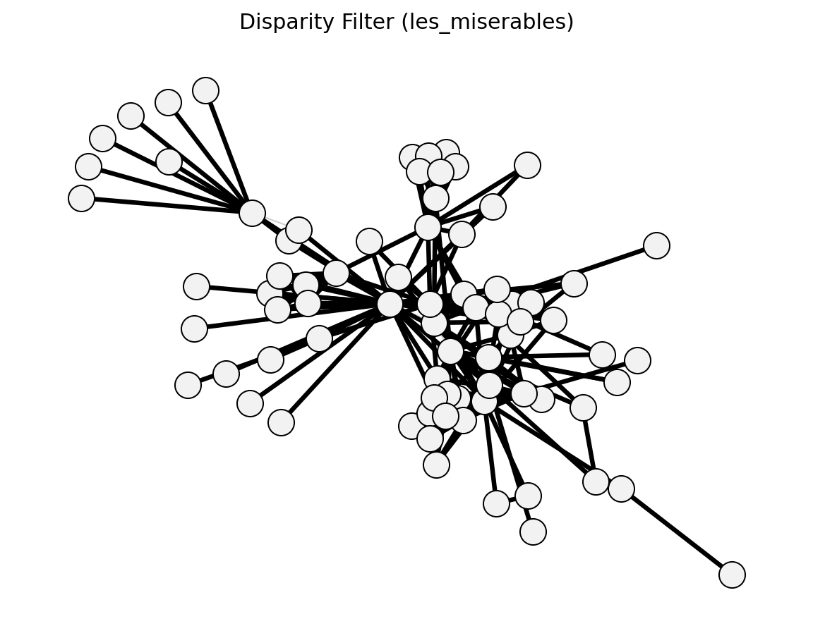

# networkx_backbone

Backbone extraction algorithms for complex networks, built on [NetworkX](https://networkx.org/).

This library provides 65 functions across 9 modules for extracting backbone
structures from weighted and unweighted networks.

Full documentation: https://www.brianckeegan.com/networkx_backbone/

## Installation

```bash
pip install networkx-backbone
```

For full functionality (required for statistical tests, bipartite methods, and some structural methods):

```bash
pip install networkx-backbone[full]
```

Or install from source:

```bash
git clone https://github.com/brianckeegan/networkx_backbone.git
cd networkx_backbone
pip install -e ".[full]"
```

## Modules

| Module | Description | Key Functions |
|--------|-------------|---------------|
| **statistical** | Hypothesis-testing methods | `disparity_filter`, `noise_corrected_filter`, `marginal_likelihood_filter`, `ecm_filter`, `lans_filter`, `multiple_linkage_analysis` |
| **structural** | Topology-based methods | `global_threshold_filter`, `strongest_n_ties`, `global_sparsification`, `primary_linkage_analysis`, `edge_betweenness_filter`, `node_degree_filter`, `high_salience_skeleton`, `metric_backbone`, `ultrametric_backbone`, `doubly_stochastic_filter`, `h_backbone`, `modularity_backbone`, `planar_maximally_filtered_graph`, `maximum_spanning_tree_backbone` |
| **proximity** | Neighborhood-similarity scoring | `jaccard_backbone`, `dice_backbone`, `cosine_backbone`, `hub_promoted_index`, `hub_depressed_index`, `adamic_adar_index`, `resource_allocation_index`, `local_path_index`, and more |
| **hybrid** | Combined approaches | `glab_filter` |
| **bipartite** | Bipartite projection backbones | `simple_projection`, `hyper_projection`, `probs_projection`, `ycn_projection`, `sdsm`, `fdsm`, `fixedfill`, `fixedrow`, `fixedcol`, `backbone` |
| **unweighted** | Sparsification for unweighted graphs | `sparsify`, `lspar`, `local_degree` |
| **filters** | Post-hoc filtering utilities | `multigraph_to_weighted`, `threshold_filter`, `fraction_filter`, `boolean_filter`, `consensus_backbone` |
| **measures** | Evaluation and comparison | `node_fraction`, `edge_fraction`, `weight_fraction`, `reachability`, `ks_degree`, `ks_weight`, `compare_backbones` |
| **visualization** | Graph comparison plotting | `graph_difference`, `compare_graphs`, `save_graph_comparison` |

## NetBone Core Coverage

Core method families used in [netbone](https://gitlab.liris.cnrs.fr/coregraphie/netbone)
(Yassin et al., 2023) are represented here, including:

- Statistical: `disparity_filter`, `marginal_likelihood_filter`, `ecm_filter`, `noise_corrected_filter`, `lans_filter`, `multiple_linkage_analysis`
- Structural: `global_threshold_filter`, `global_sparsification`, `primary_linkage_analysis`, `edge_betweenness_filter`, `high_salience_skeleton`, `doubly_stochastic_filter`, `maximum_spanning_tree_backbone`
- Hybrid: `glab_filter`

## Quick Start

```python
import networkx as nx
import networkx_backbone as nb

# Create a weighted graph
G = nx.les_miserables_graph()

# 1) Score edges
scored = nb.disparity_filter(G)

# 2) Filter edges
backbone = nb.threshold_filter(scored, "disparity_pvalue", 0.05)

# Compare backbone to original
print(f"Edges kept: {nb.edge_fraction(G, backbone):.1%}")
print(f"Nodes kept: {nb.node_fraction(G, backbone):.1%}")
```

### Disparity filter visualization



### Proximity-based scoring

```python
# Score edges by Jaccard similarity of endpoint neighborhoods
scored = nb.jaccard_backbone(G)

# Keep only the top 20% most structurally embedded edges
backbone = nb.fraction_filter(scored, "jaccard", 0.2, ascending=False)
```

### Bipartite backbone

```python
B = nx.davis_southern_women_graph()
women_nodes = [n for n, d in B.nodes(data=True) if d["bipartite"] == 0]
scored = nb.sdsm(B, agent_nodes=women_nodes, projection="hyper")
backbone = nb.threshold_filter(scored, "sdsm_pvalue", 0.05, mode="below")
```

Projection weights follow the simple/hyper/ProbS/YCN formulations described in
[Coscia & Neffke (2017)](https://arxiv.org/abs/1906.09081).

### Comparing multiple methods

```python
backbones = {
    "disparity": nb.threshold_filter(nb.disparity_filter(G), "disparity_pvalue", 0.05),
    "mst": nb.boolean_filter(nb.maximum_spanning_tree_backbone(G), "mst_keep"),
}
results = nb.compare_backbones(G, backbones)
```

## Dependencies

- **Required**: `networkx >= 3.0`
- **Optional**: `numpy >= 1.23`, `scipy >= 1.9`, `matplotlib >= 3.7` (needed for statistical methods, bipartite methods, some structural/proximity methods, visualization helpers, and docs gallery generation)

## Testing

```bash
pip install -e ".[test]"
pytest
```

## Visualization gallery

Backbone visualizations in the docs are generated with **Sphinx Gallery** from
example scripts under `docs/examples/`.

Build docs (including the graph comparison gallery and function-linked
visualizations):

```bash
pip install -e ".[docs]"
sphinx-build -b html docs docs/_build/html
```

## References

Key papers behind the implemented methods:

- Coscia, M. & Neffke, F. M. (2017). [Network backboning with noisy data](https://doi.ieeecomputersociety.org/10.1109/ICDE.2017.100). *Proc. IEEE ICDE*, 425-436.
- Coscia, M. & Neffke, F. M. (2017). [Network backboning with noisy data (arXiv:1906.09081)](https://arxiv.org/abs/1906.09081).
- Girvan, M., & Newman, M. E. J. (2002). [Community structure in social and biological networks](https://doi.org/10.1073/pnas.122653799). *PNAS*, 99(12), 7821-7826.
- Grady, D., Thiemann, C., & Brockmann, D. (2012). [Robust classification of salient links in complex networks](https://doi.org/10.1038/ncomms1847). *Nature Communications*, 3, 864.
- Hamann, M., Lindner, G., Meyerhenke, H., Staudt, C. L., and Wagner, D. (2016). [Structure-Preserving Sparsification Methods for Social Networks](https://doi.org/10.1007/s13278-016-0332-2). Social Network Analysis and Mining, 6, 22.
- Simas, T., Correia, R. B., & Rocha, L. M. (2021). [The distance backbone of complex networks](https://doi.org/10.1093/comnet/cnab021). *J. Complex Networks*, 9(6), cnab021.
- Neal, Z. P. (2014). [The backbone of bipartite projections](https://doi.org/10.1016/j.socnet.2014.06.001). *Social Networks*, 39, 84-97.
- Neal, Z. P. (2022). [backbone: An R package to extract network backbones](https://doi.org/10.1371/journal.pone.0269137). *PLoS One*, 17(5), e0269137.
- Satuluri, V., Parthasarathy, S., & Ruan, Y. (2011). [Local graph sparsification for scalable clustering](https://doi.org/10.1145/1989323.1989399). *SIGMOD*, 721-732.Serrano, M. A., Boguna, M., & Vespignani, A. (2009). [Extracting the multiscale backbone of complex weighted networks](https://doi.org/10.1073/pnas.0808904106). *PNAS*, 106(16), 6483-6488.
- Van Nuffel, N., Heyndrickx, C., & Wets, G. (2010). Measuring hierarchy and reciprocity in networks.
- Yassin, A., Haidar, A., Cherifi, H., Seba, H., & Togni, O. (2023). [An evaluation tool for backbone extraction techniques in weighted complex networks](https://doi.org/10.1038/s41598-023-42076-3). *Scientific Reports*, 13, 17000. 
- Yassin A., Cherifi, H., Seba, H., & Togni, O. (2025). [Backbone extraction through statistical edge filtering: A comparative study](https://doi.org/10.1371/journal.pone.0316141). *PLoS One*, 20(1): e0316141.
- Yassin A., Cherifi, H., Seba, H., & Togni, O. (2025). [Exploring weighted network backbone extraction: A comparative analysis of structural techniques](https://doi.org/10.1371/journal.pone.0322298). *PLoS One*, 20(5): e0322298.

Other libraries and datasets:

- Yassin, A., Haidar, A., Cherifi, H., Seba, H., & Togni, O. (2023). [netbone](https://gitlab.liris.cnrs.fr/coregraphie/netbone).
- Yassin, A., et al. (2025). [structural-backbone-methods-comparison](https://github.com/al1yass2n/structural-backbone-methods-comparison).
- Neal, Z. (2022). [backbone](https://rbackbone.net/).
- Chrol, B. & Bojanowski, M. (2018). [Proximity-based Methods for Link Prediction](https://cran.r-project.org/web/packages/linkprediction/vignettes/proxfun.html).

## License

BSD 3-Clause License. See [LICENSE](LICENSE) for details.
